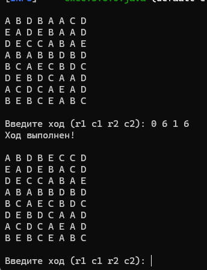

 Прототип консольной игры «Три-в-ряд»
1. Описание:
   Консольная реализация классической игры «Три-в-ряд» на Java 17.
   Игровое поле — сетка 8×8 из элементов 5 типов (A, B, C, D, E).
   Цель — переставлять соседние элементы, образовывая ряды или столбцы из трёх и более одинаковых элементов.
   Такие комбинации удаляются, элементы падают вниз, пустоты заполняются новыми. Реализована поддержка каскадов.
   Формат ввода хода - вводить четыре целых числа через пробел:

   <row1> <col1> <row2> <col2>
   row1, col1 — координата первой клетки (строка, столбец);
   row2, col2 — координата второй клетки.
   Нумерация начинается с 0, клетки должны быть соседними по вертикали или горизонтали.

2. Структура проекта (пакеты):
   gameboard/ - Модель поля и элементов;
   engine/ - Логика игры;
   statistic/ - Учёт статистики и очков;
   ui/ - Интерфейс пользователя (консоль).

4. Инструкция по сборке и запуску:
   Перейдите в корневую папку проекта, где находится папка src и введите команду (предварительно должны быть установлены java и maven):
   mvn clean compile exec:java

   После запуска вы увидите консольное поле 8×8 и приглашение ввести ход.

4. Реализовано:
- Генерация стартового поля без начальных комбинаций;
- Перестановка соседних элементов;
- Обнаружение и удаление комбинаций (3+ одинаковых элементов подряд);
- “Падение” элементов вниз и заполнение новыми;
- Обработка каскадов (понижение и дозаполнение до стабилизации).

5. Дальнейшие улучшения (план)
- Добавить бонусы;
- Проверка хода на валидность (только ходы, создающие комбинации);
- Вывод статистики;
- Поддержка дополнительных типов элементов или других размеров поля.
- Возможно графический интерфейс.
6. Скрин работы игры:

